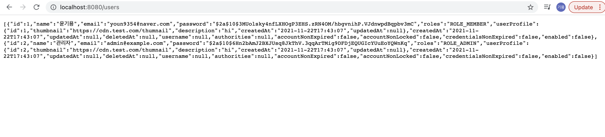

# SpringBoot with AdminLTE 2
---

Application with SpringBoot and the AdminLTE 2 template to facilitate development.

characteristics
---

* Spring Boot;
* Spring Security for basic login with permissions;
* Thymeleaf as view Template Engine;
* MySQL as Database or others;
* Basic customer CRUD;

TODO
---

* Search in the listing;
* Model of Dialog;
* Template for sending e-mail with template;

Run the application:
---
We assume that You already installed maven and JDK 8 (minimum) on your environment.
1. Clone the repository: `git clone https://github.com/Youngiyong/springboot-code/springboot-adminlte.git`
2. Go to the folder: `cd springboot-adminlte`
3. Run the app: `mvn clean springboot:run`
4. Run docker: `cd docker && docker-compose up`
5. Open Your favorite browser, then go to http://localhost:8080

It is free to make changes and implementations and make the code more evolved.

| #   | email | Password |
| --- |:--------:| --------:|
| 1   | youn9354@naver.com    | 1234     |
| 2   | admin@example.com   | 1234     |

## Screenshot

Login Page

Dashboard Page

Add Customer Page

List Page

List Users Page By admin@example.com

