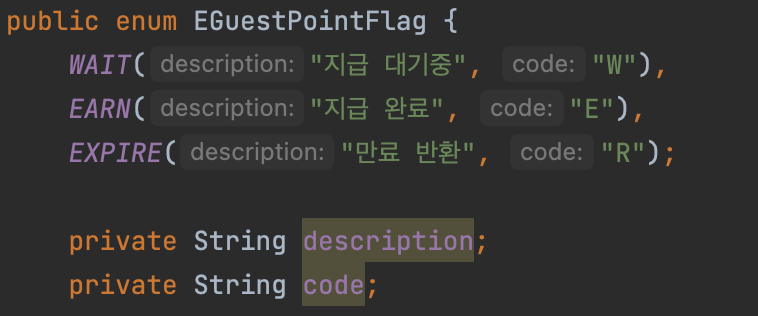
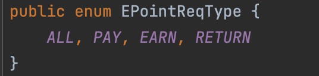

# Springboot-practice 에서 사용하는 Enum, Entity, Converter 

## 생성 규칙

- 2개 이상의 값으로 구성된 컬럼의 경우 접미어는 “_flag”를 사용한다.
    - ex)point_flag
- true, false 값으로 구성될 경우 접두어를 “is_”를 사용한다.
    - ex) is_main

  

- enum 클래스의 접두어는 “E”로 시작한다.
- 단순값만 나열하는 클래스일 경우 접미어를 “Type”으로 사용한다.

  - ex) ETestType
  
  
