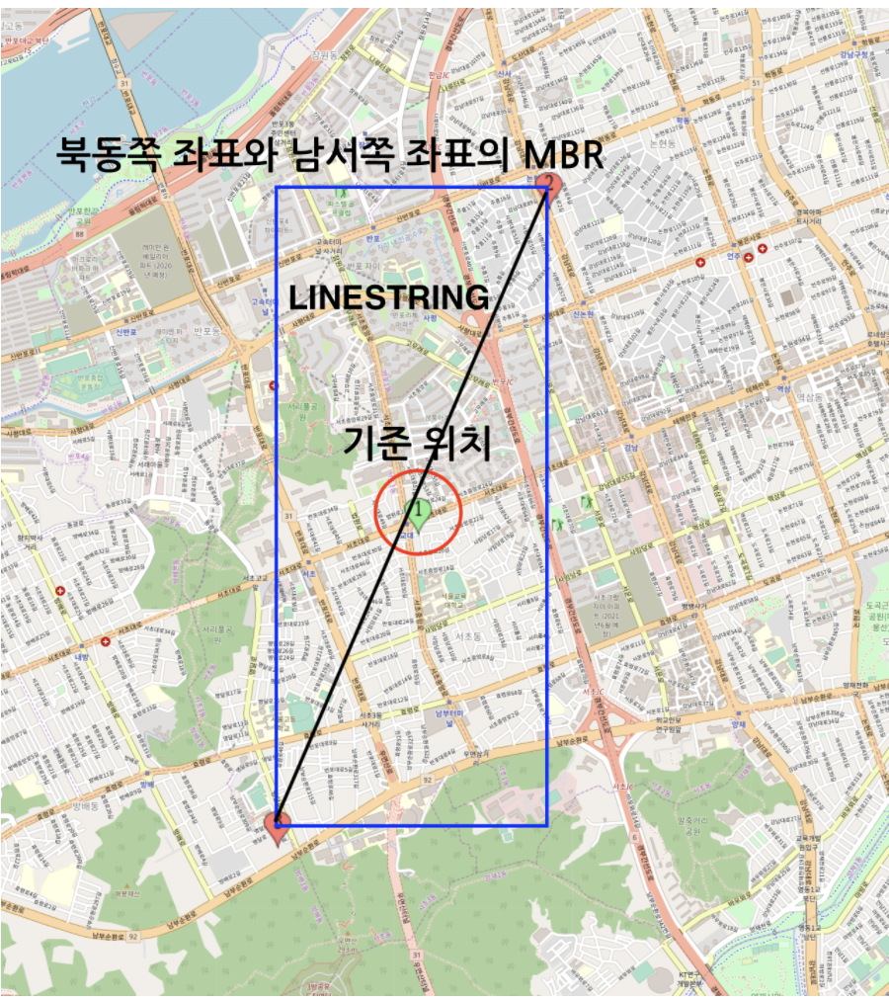
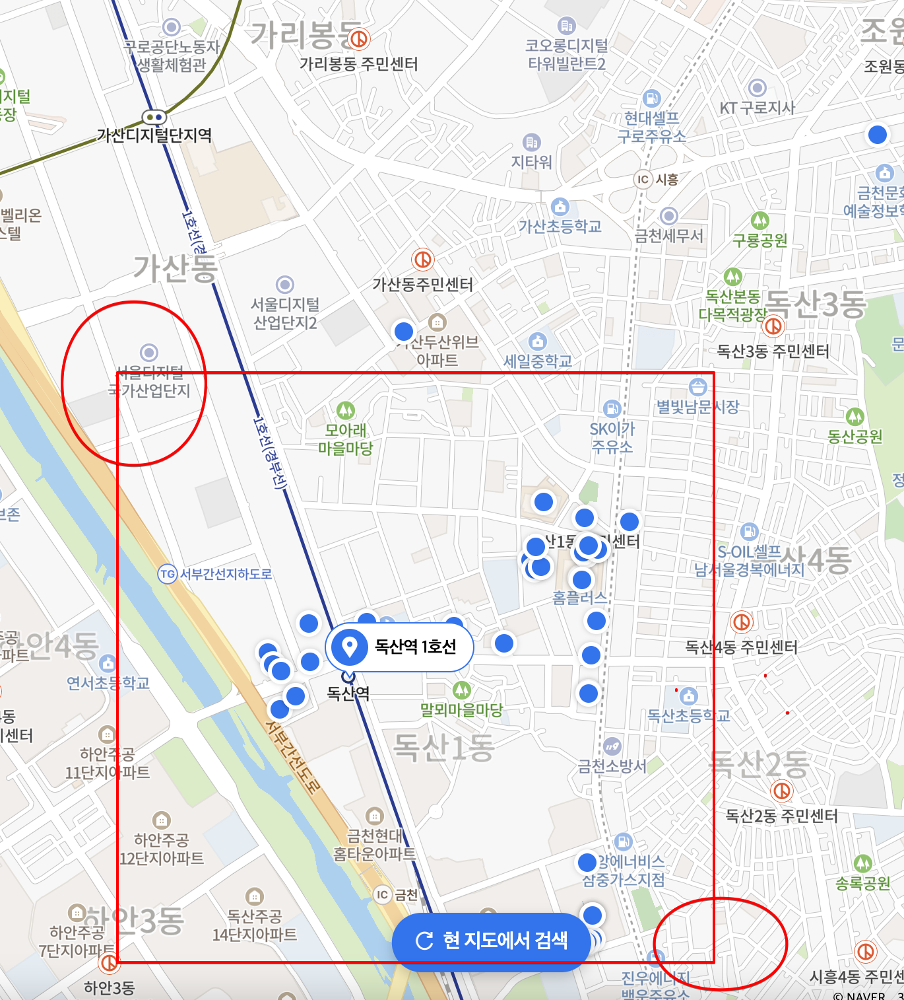

# Spring JPA + MySQL + Point

### Backend
Spring Boot 2.5.7
Hibernate 5.4.22
MySQL 5.7
Gradle
### Project Setting
```
1. git clone 
2. create database, table, INSERT data (Post Constrcut)
```

### 이론
```
MySQL 5.7부터 공간 데이터 타입을 지원

MBR(Minimum Bounding Rectangles)
최소 경계 사각형이라는 뜻 
지도 상의 임의의 사각형 구역
공간 관련 연산시 사용하는 용어

POINT
지도 상의 경도, 위도 값을 표현하는 객체
MySQL의 Spatial Data Type 중 하나

LINESTRING
지도 상의 하나의 선을 의미하며, 일련의 Point들로 이루어진 객체
MySQL의 Spatial Data Type

기준 좌표 : x,y
기준 좌표의 북동쪽으로 nKM에 위치한 좌표 : x1, y1
기준 좌표의 남서쪽으로 nKM에 위치한 좌표 : x2, y2

SELECT *
FROM store as s
WHERE MBRCONTAINS(ST_LINESTRINGFROMTEXT('LINESTRING(x1 y1, x2 y2)'), s.location);

SQL 설명

MBRContains(g1, g2) : g1의 MBR에 g2의 MBR이 포함되는지 검사하는 함수
ST_LINESTRINGFROMTEXT : WKT 표현식으로 표현된 문자열을 이용해 LINESTRING 객체를 만드는 함수

기준 위치로부터 nKM 떨어진 북동쪽 및 남서쪽 좌표를 이은 대각선(LINESTRING)의 MBR은 직사각형
따라서 MBRContains(g1, g2)는 g1의 직사각형안에 g2 데이터가 포함되는지 찾는 연산 true / false
```



### API TEST
```
http://localhost:9300/api/user/store?count=10&latitude=37.46627599&longitude=126.887395
```

### SQL Query
```
SELECT
    s.id as id,
    s.name as name,
    ST_DISTANCE_SPHERE(POINT(126.886315,
                             37.485304),
                       POINT(ST_Y(location), ST_X(location))
        )  as distance,
    s.address as address,
    ST_X(s.location) as lat,
    ST_Y(s.location) as lng
FROM
    store AS s
WHERE
    MBRContains(ST_LINESTRINGFROMTEXT('LINESTRING(37.491663 126.894330, 37.478944 126.878302)'), s.location)
ORDER BY distance asc
limit 20;

```

```
독산역 기준 반경 1km 탐색 count 미만 조회시 다시 조회
```


```aidl
{
    "code": 0,
    "data": {
        "storeList": [
            {
                "id": 659,
                "name": "이디야커피 가산대륭19차점",
                "distance": 1073.5475411145783,
                "address": "서울특별시 금천구 가산동 345-29 지상1층 101호",
                "thumbnail": "https://ldb-phinf.pstatic.net/20201218_157/1608286215970a0JSl_JPEG/xBRBneDw4GnGoXMzpdHmNh8_.jpg",
                "lat": 37.4749171,
                "lng": 126.8819692
            },
            {
                "id": 246,
                "name": "이디야커피 가산대륭19차점",
                "distance": 1073.5475411145783,
                "address": "서울특별시 금천구 가산동 345-29 지상1층 101호",
                "thumbnail": "https://ldb-phinf.pstatic.net/20201218_157/1608286215970a0JSl_JPEG/xBRBneDw4GnGoXMzpdHmNh8_.jpg",
                "lat": 37.4749171,
                "lng": 126.8819692
            },
            {
                "id": 662,
                "name": "카페 어니스트",
                "distance": 1076.1026478195004,
                "address": "서울특별시 금천구 가산동 345-29",
                "thumbnail": "",
                "lat": 37.4750189,
                "lng": 126.8821667
            },
            {
                "id": 665,
                "name": "착한커피 대륭19차점",
                "distance": 1076.1026478195004,
                "address": "서울특별시 금천구 가산동 345-29",
                "thumbnail": "",
                "lat": 37.4750189,
                "lng": 126.8821667
            },
            {
                "id": 667,
                "name": "커피레벨 52",
                "distance": 1076.1026478195004,
                "address": "서울특별시 금천구 가산동 345-29",
                "thumbnail": "",
                "lat": 37.4750189,
                "lng": 126.8821667
            },
            {
                "id": 249,
                "name": "카페 어니스트",
                "distance": 1076.1026478195004,
                "address": "서울특별시 금천구 가산동 345-29",
                "thumbnail": "",
                "lat": 37.4750189,
                "lng": 126.8821667
            },
            {
                "id": 252,
                "name": "착한커피 대륭19차점",
                "distance": 1076.1026478195004,
                "address": "서울특별시 금천구 가산동 345-29",
                "thumbnail": "",
                "lat": 37.4750189,
                "lng": 126.8821667
            },
            {
                "id": 254,
                "name": "커피레벨 52",
                "distance": 1076.1026478195004,
                "address": "서울특별시 금천구 가산동 345-29",
                "thumbnail": "",
                "lat": 37.4750189,
                "lng": 126.8821667
            },
            {
                "id": 295,
                "name": "크루미디어",
                "distance": 1079.5309601231504,
                "address": "서울특별시 금천구 가산동 345-29",
                "thumbnail": "",
                "lat": 37.4750139,
                "lng": 126.8820637
            },
            {
                "id": 658,
                "name": "피아카페",
                "distance": 1079.5309601231504,
                "address": "서울특별시 금천구 가산동 345-29",
                "thumbnail": "https://ldb-phinf.pstatic.net/20211027_145/1635296359960b0EB7_GIF/xOvVQycuwhL_R-8wGmgWz4ry.gif",
                "lat": 37.4750139,
                "lng": 126.8820637
            }
        ]
    },
    "totalCount": 10
}
```


