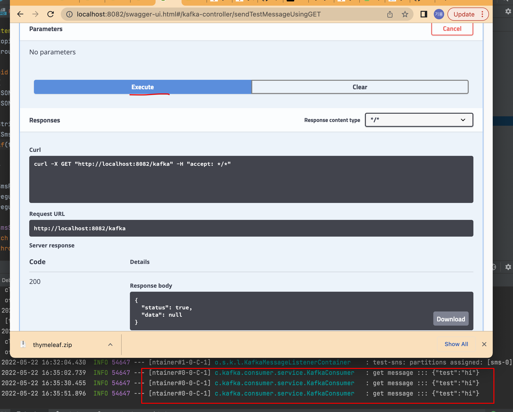

# SpringBoot kafka producer

### Project Setting
```
1. Open Project
2. Application Activate Profile - dev
3. docker-compose (mysql || h2) && kafka up
4. Kafka Topic Create
5. Require Sms Test Naver Cloud Get Sms AceessKey, SecretKey And Setting application-dev.yml
6. Run/Debug Start
7. http://localhost:8082/swagger-ui/index.html
```


### Topic Create
```
1. shell access
docker exec -it kafka /bin/bash

2. create topic 
kafka-topics.sh --create --bootstrap-server localhost:9092 --topic test
kafka-topics.sh --create --bootstrap-server localhost:9092 --topic sms

3. topic list 
kafka-topics.sh --list --bootstrap-server localhost:9092
test
sms
```

